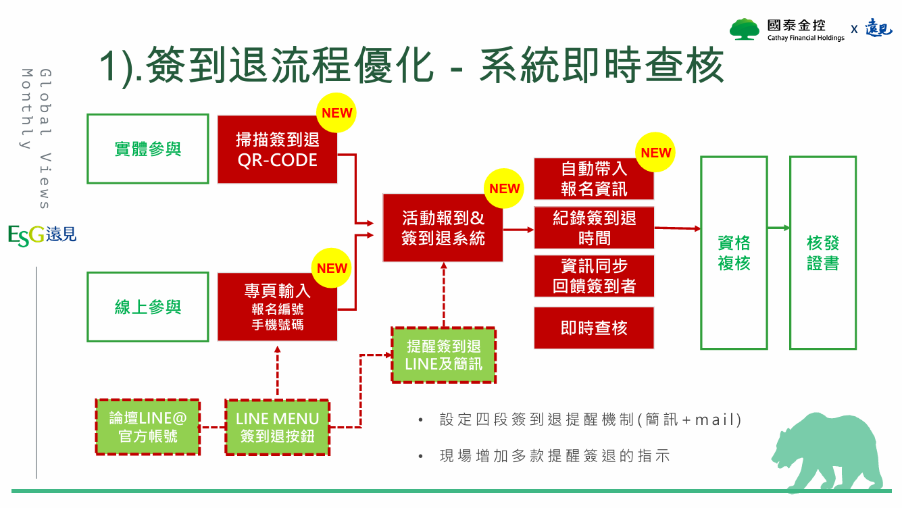

# 產品需求規格書 (PRD) - 遠見天下文化 論壇報到系統

## 1. 專案概述 (Project Overview)
- **專案名稱**：遠見天下文化 論壇報到系統
- **專案背景**：因應法規與活動管理需求，針對既有報到雛型進行功能擴充與介面優化，打造穩定且嚴格符合時段限制的線上報到系統。
- **核心目標**：
  1. 淘汰舊有紙本與繁瑣流程，加速報到與退場效率。
  2. 讓主辦方能即時掌握出席率與報到狀況。
  3. 未來具備與內部 CRM、報名系統或會員資料庫串接的擴充性。
- **開發階段**：簽到/簽退機制、防呆控制與學習時數計算顯示。
- **【首要重點】效能與高併發要求**：系統需能承載活動開始前（如 08:30~09:00 間）瞬間湧入的大量併發報到流量，絕對確保「點擊無延遲與不漏單」。

---

## 2. 使用者與使用場景 (Users & Scenarios)
- **終端使用者（與會者）**：
  - **裝置**：一律僅使用「個人手機」操作 (Mobile Web)。
  - **場景**：使用個人手機開啟指定網頁進行自助簽到/簽退。
- **管理與客服人員（工作人員）**：
  - **場景**：當與會者遇到「查無手機、網路異常、長輩不會操作」等狀況時，由現場或線上服務人員統一接手處理。

---

## 3. 核心功能規格 (Core Features)

**【專案開發範圍說明】**

下方為活動整體流程圖，**本專案（線上報到系統）之開發與實作範圍，僅需處理圖中「紅底區塊」的部分**。




### 3.1 身份驗證與資料流
- **資料來源**：遠見活動管理後台會預先匯入一批該場活動的「報名名單」（包含：報到編號、姓名、公司名稱、手機、上午簽到時間、上午簽退時間、下午簽到時間、下午簽退時間）。
- **身分識別**：使用者於手機網頁輸入**「手機號碼」** 作為唯一識別。
- **驗證邏輯**：
  - 系統比對輸入的手機號碼是否存在於報名名單中。
  - 若**查無此號碼**，系統需阻擋操作並跳出提示：`「查無此人（請輸入報名的手機號碼）；或洽現場服務人員」`。

### 3.2 嚴格簽到/簽退時限與防呆機制 (法規要求)
- 系統提供 4 個打卡動作，且嚴格綁定伺服器時間，**未在指定時間範圍內，絕對不可以點擊或寫入紀錄**。 
- 不可操作的按鈕必須反灰 (Disabled)**

| 動作 | 允許開放時間範圍 |
| :--- | :--- |
| **上午簽到** | 2026-07-01 08:30:00 ~ 10:00:00 |
| **上午簽退** | 2026-07-01 11:40:00 ~ 13:00:00 |
| **下午簽到** | 2026-07-01 13:30:00 ~ 14:30:00 |
| **下午簽退** | 2026-07-01 16:40:00 ~ 17:30:00 |

- **非開放時段之防呆顯示**：若使用者於不在上述任何開放時段內進行操作或點擊，系統需阻擋動作，並明確顯示以下提示文案與時間資訊，避免使用者困惑：
  ```text
  目前不在任何可簽到時段
  目前時間：[帶入當下系統時間，例如 2026/07/01 10:15]
  上午簽到 2026-07-01 08:30:00 ~ 10:00:00
  上午簽退 2026-07-01 11:40:00 ~ 13:00:00
  下午簽到 2026-07-01 13:30:00 ~ 14:30:00
  下午簽退 2026-07-01 16:40:00 ~ 17:30:00
  ```

- **防重複點擊機制**：若使用者於「同一時段內」多次點擊同一個按鈕，系統資料庫**僅記錄「最早」的一筆時間**，不允許覆蓋。
- **防弊機制**：基於現有需求，採「信任機制（靜態驗證）」，不強制要求開啟 GPS 定位或動態 QR Code。

### 3.3 簽到紀錄查詢與時數計算 (User Self-Service)
- 提供專屬查詢區塊，與會者輸入手機號碼後，可隨時查看自己今日的報到狀態。
- **時數計算邏輯**：
  - 預設累積學習時數為 0 小時。
  - 當使用者完成「上午簽到 + 上午簽退」時，即 +3 小時。
  - 當使用者完成「下午簽到 + 下午簽退」時，即 +3 小時。
  - (全天皆完成即為 6 小時)
- **個資隱碼（Masking）規範**：
  - 介面上顯示「姓名」時，須採用銀行級隱碼規則處理以保護個資：
    - 2 個字：隱藏第二個字（例：王大 ➔ 王Ｏ）
    - 3 個字：隱藏中間字（例：王大明 ➔ 王Ｏ明）
    - 4 個字（含）以上：保留首尾字，中間皆隱藏（例：歐陽大明 ➔ 歐ＯＯ明）
- **查詢結果介面呈現規範**（範例）：
  ```text
  {隱碼後姓名，例如：金Ｏ萌}
  {公司名稱}
  報名編號：{報名編號}

  上午簽到：⬜ (或 ✅)
  上午簽退：⬜ (或 ✅)
  下午簽到：✅
  下午簽退：⬜
  今日累積學習時數：0 小時
  ```

### 3.4 UI/UX 與介面規範
- **裝置適配**：Mobile-Only / Mobile-First（以手機直式瀏覽體驗為主）。
- **介面元素**：
  - **Header**：主標題 (名稱待定) + 品牌 Logo (主視覺確認後提供)。
  - **Footer**：`Copyright© 2025 遠見天下文化出版股份有限公司. All rights reserved.`
  - **按鈕狀態**：必須在「非開放時間」將對應的按鈕反灰 (Disabled)，明確告知使用者當下無法操作。

---

## 4. 例外與客服處理流程 (Edge Cases)
當與會者發生以下任一狀況時，系統不提供前端強制解鎖功能，一律透過文案引導至客服：
1. **查無報名資料** (輸入錯誤或未報名)
2. **手機網路異常** 無法載入網頁
3. **長者不熟悉手機操作**
* **標準作業程序 (SOP)**：畫面提示「查無此人（請輸入報名的手機號碼）；或洽現場服務人員」，後續處理一律聯繫現場或線上服務人員進行特殊註記或補登。

---

## 5. 系統效能與架構要求 (For IT Team)

- **架構決議**：底層技術架構與資料庫選型，全權交由 IT 部門根據本專案之上線時程、資安規範與流量需求決定。
- **紀錄備查**：系統資料庫需完整記錄每一筆成功報到的伺服器時間戳記 (Timestamp)，且格式必須精準到秒（`yyyy-mm-dd hh:mm:ss`），以應對後續法規查核。
